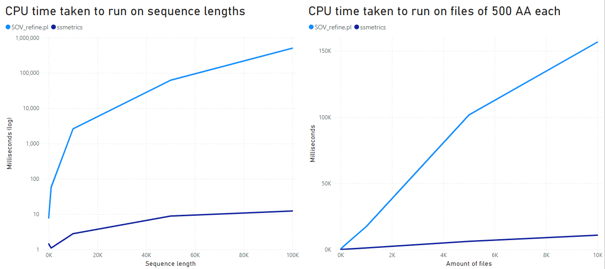

# Secondary Structure Metrics Calculator

A Windows, MacOS, and Linux application to calculate metrics commonly used for Protein Secondary Structure Prediction (PSSP) research.
The metrics that can be calculated include: Accuracy (Q3, Q8, ...), Loose Overlap, Strict Overlap, Original Segment Overlap (SOV 94), Improved Segment Overlap (SOV 99), Refined Segment Overlap (SOV Refine)

Please cite our work...

```
TBD
```

and the papers for the metric/s you utilize.

For Loose Overlap, Strict Overlap, SOV94 cite:

```
@article{ROST1994,
	title = {Redefining the goals of protein secondary structure prediction},
	journal = {Journal of Molecular Biology},
	volume = {235},
	number = {1},
	pages = {13-26},
	year = {1994},
	issn = {0022-2836},
	doi = {https://doi.org/10.1016/S0022-2836(05)80007-5},
	url = {https://www.sciencedirect.com/science/article/pii/S0022283605800075},
	author = {Burkhard Rost and Chris Sander and Reinhard Schneider},
}
```

For SOV99 cite:

```
@article{Zemla1999,
	author = {Zemla, Adam and Venclovas, Ceslovas and Fidelis, Krzysztof and Rost, Burkhard},
	title = {A modified definition of Sov, a segment-based measure for protein secondary structure prediction assessment},
	journal = {Proteins: Structure, Function, and Bioinformatics},
	volume = {34},
	number = {2},
	pages = {220-223},
	doi = {https://doi.org/10.1002/(SICI)1097-0134(19990201)34:2<220::AID-PROT7>3.0.CO;2-K},
	url = {https://onlinelibrary.wiley.com/doi/abs/10.1002/%28SICI%291097-0134%2819990201%2934%3A2%3C220%3A%3AAID-PROT7%3E3.0.CO%3B2-K},
	year = {1999}
}
```

For SOVRefine cite:

```
@article{Liu2018,
	title = {{SOV}\_refine: {A} further refined definition of segment overlap score and its significance for protein structure similarity},
	volume = {13},
	issn = {1751-0473},
	url = {https://doi.org/10.1186/s13029-018-0068-7},
	doi = {10.1186/s13029-018-0068-7},
	number = {1},
	journal = {Source Code for Biology and Medicine},
	author = {Liu, Tong and Wang, Zheng},
	year = {2018},
	pages = {1},
}
```

# Installation

For easy installation, download the zip file according to your Operating System (OS) from the [latest release](https://github.com/ivanpmartell/SecondaryStructureMetrics/releases/latest).

This will include the executable file ready to be used in your machine.

# Install from source

1. Clone this repository.
2. Obtain a C++ compiler for your OS.
3. Install [VCPkg](https://learn.microsoft.com/en-us/vcpkg/get_started/get-started?pivots=shell-cmd) following step 1 from the linked URL.
	- We suggest downloading the vcpkg repository as opposed to cloning it, since it can be slow.
	- For unix, install under `/opt/`. For Windows, install Visual Studio with the C++ workloads.
4. Configure and build the project using CMake with the preset for your OS (CMakePresets.json).
	- Alternatively, create your own preset making sure to define "CMAKE_TOOLCHAIN_FILE" with the location of vcpkg.cmake script installed from step 3.

# Usage

```
Secondary structure metric calculator
Usage: ./ssmetrics [OPTIONS]

Options:
  -h,--help                   Print this help message and exit
  -r,--reference TEXT REQUIRED
                              Reference sequence (Fasta file also accepted)
  -p,--predicted TEXT REQUIRED
                              Predicted sequence (Fasta file also accepted)
  -m,--metric TEXT            Name of the metric to calculate. Ignore to calculate all metrics.
                              Metric Choices: Accuracy, SOV94, SOV99, SOVrefine, LooseOverlap, StrictOverlap
  -l,--lambda FLOAT           Adjustable scale parameter for SOVrefine
  -z,--zeroDelta              This will omit the delta value (delta = 0)
```

## Example

```
./ssmetrics -r CCHHHHHCCC -p CCCHHHHHCC
```

# Validation

We have created tests to ensure the validity of the calculations by obtaining the same results as the original papers.
These tests are performed every time a new build of the application is created.


The tests can be seen in the latest workflow run for each OS [here](https://github.com/ivanpmartell/SecondaryStructureMetrics/actions).

# Performance

This application was created as an improvement of previously existing PSSP metric calculation apps.
Most notably, our app improves the calculation speed of all metrics over the SOV_refine.pl script from the SOV_refine paper.
This performance improvement is important when calculating metrics for long sequences and also when the metrics need to be obtained for many sequences.

The results shown below were obtained using the `docs/perf_comparison.sh` script. Lower is better.

